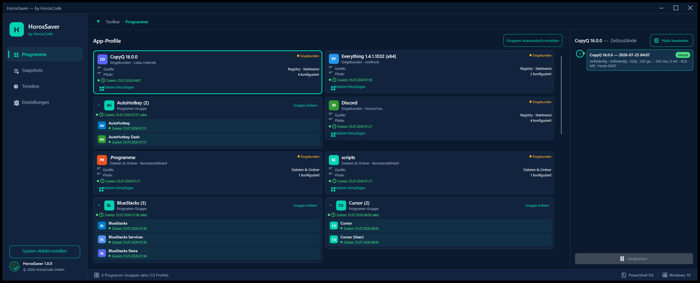
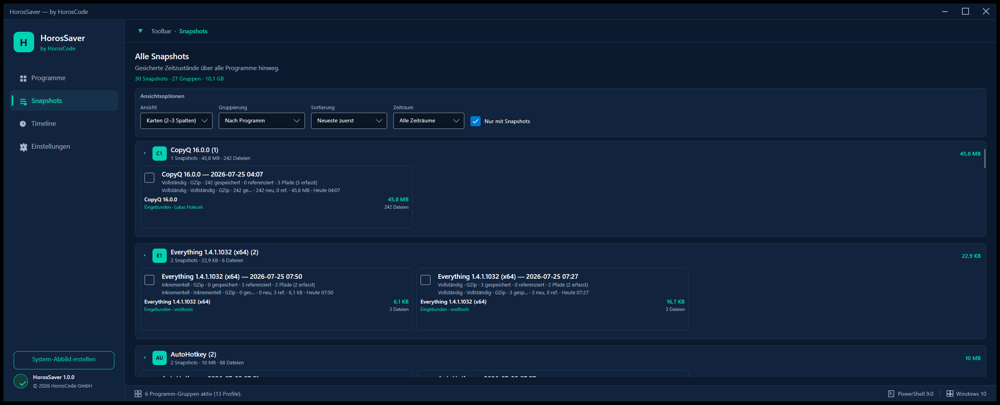
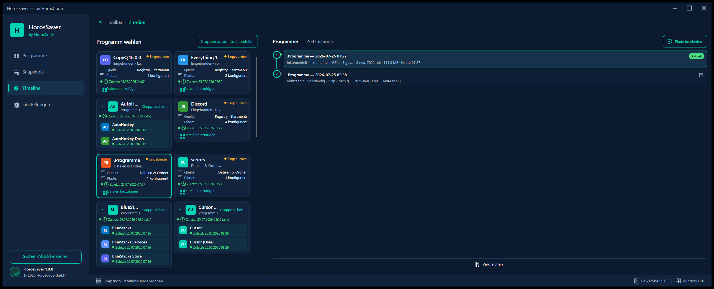
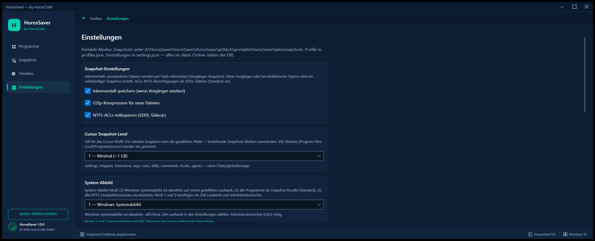
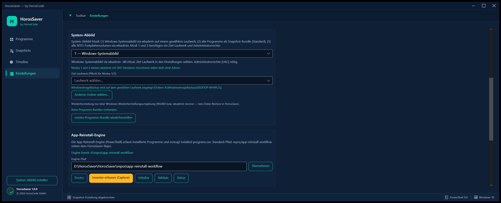
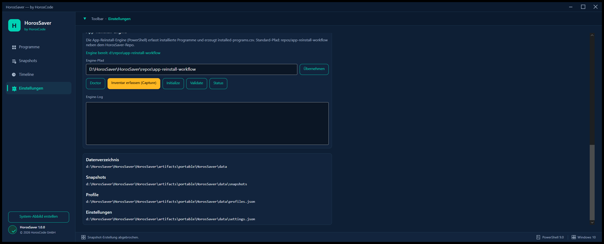

# HorosSaver

**HorosSaver** ist ein Desktop-Produkt von **[HorosCode](https://horoscode.de)** zum Ordnen von Programmen, Speichern von Zeitzuständen (Snapshots) und Wiederherstellen von Anwendungsprofilen — z. B. **Cursor** inklusive Settings, Keybindings, Extensions und Workspace-Daten.

## Stack


| Komponente | Technologie                  |
| ---------- | ---------------------------- |
| UI         | Avalonia 12.x                |
| Runtime    | .NET 9                       |
| Pattern    | MVVM (CommunityToolkit.Mvvm) |
| Plattform  | Windows (MVP)                |


## Schnellstart

```powershell
cd d:\HorosSaver\HorosSaver\HorosSaver
dotnet build
dotnet run --project src\HorosSaver\HorosSaver.csproj
```


## Screenshots

HorosSaver nutzt eine dunkle Dev-Tool-Oberfläche (Sidebar, Karten, Timeline). Die Bilder stammen aus der laufenden App (Windows, portable Build).

### Programme — Hauptansicht

App-Profile mit eingebundenen Programmen, Detailkarte und Zeitzustände für das ausgewählte Profil (z. B. CopyQ).



### Snapshots — Übersicht

Alle gespeicherten Snapshots über Programme hinweg, inkl. Kompression und Pfad-Hinweisen.

**Ansichtsoptionen** (werden in `data/settings.json` gespeichert):

| Option | Werte |
|--------|--------|
| **Ansicht** | Karten / Kompakte Liste / Tabelle / Galerie / Kompakt-Gitter / Chronologie / Baum |
| **Gruppierung** | Nach Programm-Gruppe / Nach Programm / Keine / Nach Datum (Tag) |
| **Sortierung** | Neueste zuerst / Älteste zuerst / Name A–Z / Größe |
| **Zeitraum** | Alle / 7 / 30 / 90 Tage |
| **Filter** | „Nur mit Snapshots“ (zeigt sonst auch leere Programme) |

Zusätzlich: Statistikzeile (`X Snapshots · Y Gruppen · Z MB`), Mehrfachauswahl mit Batch-Wiederherstellen/Löschen, Größe & Dateianzahl pro Karte/Gruppe, Kontextmenü inkl. **Umbenennen / Bearbeiten** (EditSnapshot). Unter **Ansicht** stehen sieben Darstellungsmodi zur Verfügung (Karten, Kompakte Liste, Tabelle, Galerie, Kompakt-Gitter, Chronologie, Baum) — die Wahl wird in `settings.json` gespeichert.



### Timeline — Zeitzustände

Programm wählen und Snapshot-Historie mit Vergleich für ein Profil.



### Einstellungen

Vollständiger Einstellungsbereich (zusammengesetzt aus drei Scroll-Ausschnitten): Snapshot-Optionen, Cursor Snapshot-Level, System-Abbild, App-Reinstall-Engine, Datenverzeichnis und Snapshots.







## Portable Edition (empfohlen)

**Kein Installer nötig** — self-contained Ordner mit allen Daten im App-Verzeichnis. Ideal zum Kopieren auf ein neues System inkl. Snapshots/Restore.

```powershell
cd d:\HorosSaver\HorosSaver\HorosSaver
.\scripts\HorosSaver.bat build
```

Oder **Build + Start** mit Doppelklick auf `scripts\HorosSaver.bat` (baut automatisch, wenn die EXE noch fehlt).

Doppelklick auf `artifacts\portable\HorosSaver\starter.bat` (oder den ganzen Ordner kopieren).


| Artefakt                   | Pfad                                  |
| -------------------------- | ------------------------------------- |
| **Portable-Paket**         | `artifacts\portable\HorosSaver\`      |
| Daten (Profile, Snapshots) | `artifacts\portable\HorosSaver\data\` |
| Logs                       | `artifacts\portable\HorosSaver\logs\` |
| Anleitung                  | `README-PORTABLE.md` (auch im Paket)  |


Details: siehe Abschnitt **Daten & Speicherorte** unten und `README-PORTABLE.md`.

## Windows-Installer (optional, Legacy)

Der Installer enthält die **komplette .NET-9-Desktop-Runtime** — auf einem frischen Windows-PC ist **kein vorinstalliertes .NET** nötig.

### Voraussetzungen (Build-Maschine)


| Tool                         | Zweck        | Installation                                                  |
| ---------------------------- | ------------ | ------------------------------------------------------------- |
| **.NET 9 SDK**               | Publish      | [dotnet.microsoft.com](https://dotnet.microsoft.com/download) |
| **Inno Setup 6** (empfohlen) | Setup-EXE    | `winget install JRSoftware.InnoSetup`                         |
| WiX Toolset 3.x (optional)   | MSI-Fallback | `winget install WiXToolset.WiXToolset`                        |


Ohne Inno/WiX erzeugt das Skript ein **portables ZIP** mit `Setup.ps1`.

### Build-Befehle

```powershell
cd d:\HorosSaver\HorosSaver\HorosSaver

# Portable-Paket bauen (self-contained)
.\scripts\HorosSaver.bat build

# Portable-Paket starten (ohne Build)
.\scripts\HorosSaver.bat start

# Build bei fehlender EXE + Start
.\scripts\HorosSaver.bat
```

Für den **Windows-Installer** (Inno Setup / WiX) siehe `installer\` und den Publish-Befehl unten — die früheren PowerShell-Skripte wurden durch `HorosSaver.bat` ersetzt.

### Output-Pfade


| Artefakt                   | Pfad                                                              |
| -------------------------- | ----------------------------------------------------------------- |
| Publish-Ordner             | `artifacts\publish\win-x64\`                                      |
| Setup-EXE (Inno)           | `artifacts\installer\HorosSaver-Setup-1.0.0-win-x64.exe`          |
| MSI (WiX, falls kein Inno) | `artifacts\installer\HorosSaver-Setup-1.0.0-win-x64.msi`          |
| Portable ZIP (Fallback)    | `artifacts\installer\HorosSaver-Setup-1.0.0-win-x64-portable.zip` |


### Installation auf Ziel-PC

**Mit Setup-EXE (Inno):** Doppelklick → Standardziel `%LocalAppData%\Programs\HorosSaver` (oder „Für alle Benutzer“ → `Program Files\HorosCode\HorosSaver`). Startmenü-Verknüpfung wird angelegt; Desktop optional.

**Mit portablem ZIP:** ZIP entpacken, dann:

```powershell
pwsh -ExecutionPolicy Bypass -File .\Setup.ps1 -DesktopShortcut -Launch
```


### Was mitgeliefert wird

- `HorosSaver.exe` + alle Avalonia-/Native-Bibliotheken
- **Self-contained .NET 9 Desktop Runtime** (im Publish-Ordner, typisch ~80–120 MB)
- **Nicht** enthalten: Benutzerdaten (`profiles.json`, Snapshots unter `%LocalAppData%\HorosCode\HorosSaver\`) — Updates überschreiben diese nicht


### Publish-Befehl (Referenz)

```powershell
dotnet publish src\HorosSaver\HorosSaver.csproj `
  -c Release -r win-x64 --self-contained true `
  -p:PublishSingleFile=false `
  -p:IncludeNativeLibrariesForSelfExtract=true `
  -p:PublishReadyToRun=true `
  -o artifacts\publish\win-x64
```


## Projektstruktur

```
HorosSaver/
├── HorosSaver.sln
├── README.md
└── src/HorosSaver/
    ├── Models/           # ProgramProfile, SnapshotInfo, Manifest
    ├── Services/         # Profile-, Snapshot-, Pfad-Auflösung
    ├── ViewModels/       # Main + Regions (Sidebar, Programme, Timeline)
    ├── Views/            # AXAML Shell (mockup-orientiert)
    └── Styles/           # HorosCode Dark-Theme
```


## Daten & Speicherorte


### Portable-Modus (Publish / `starter.bat`)


| Inhalt                  | Pfad                                                                              |
| ----------------------- | --------------------------------------------------------------------------------- |
| **Snapshots**           | `{AppDir}\data\snapshots\{programId}\{snapshotId}\`                               |
| **Profile**             | `{AppDir}\data\profiles.json`                                                     |
| **Einstellungen**       | `{AppDir}\data\settings.json`                                                     |
| **App-Logs**            | `{AppDir}\logs\horossaver-YYYYMMDD.log`                                           |
| **Starter-Log**         | `{AppDir}\logs\starter.log`                                                       |
| **zu saven (optional)** | `{AppDir}\zu saven`, `{AppDir}\data\zu-saven.txt` oder `HOROSSAVER_ZU_SAVEN_PATH` |


Aktivierung: `starter.bat` setzt `HOROSSAVER_PORTABLE=1`, oder Marker `portable.txt` / `HorosSaver.portable` neben der EXE, oder `HOROSSAVER_DATA_ROOT`.

### Entwicklung (`dotnet run`) — Standard


| Inhalt                    | Pfad                                                                          |
| ------------------------- | ----------------------------------------------------------------------------- |
| **Snapshots**             | `%LocalAppData%\HorosCode\HorosSaver\snapshots\{programId}\{snapshotId}\`     |
| **Profile**               | `%LocalAppData%\HorosCode\HorosSaver\profiles.json`                           |
| **Manifest pro Snapshot** | `...\snapshots\{programId}\{snapshotId}\manifest.json`                        |
| **zu saven (optional)**   | `%LocalAppData%\HorosCode\HorosSaver\zu-saven.txt` oder Repo-Datei `zu saven` |
| **Logs**                  | `%LocalAppData%\HorosCode\HorosSaver\logs\horossaver-*.log`                   |


**Migration:** Alte Installer-Daten unter `%LocalAppData%\HorosCode\HorosSaver\` können manuell nach `data\` im portable Ordner kopiert werden (siehe `README-PORTABLE.md`).

### „zu saven“-Seeding (automatisch beim Start)

Beim App-Start liest `ZuSavenSeeder` die Datei `zu saven` (Repo-Root, `%LocalAppData%\HorosCode\HorosSaver\zu-saven.txt` oder `HOROSSAVER_ZU_SAVEN_PATH`) und bindet Einträge **idempotent** in `profiles.json` ein:


| Eintragstyp         | Verhalten                                                                   |
| ------------------- | --------------------------------------------------------------------------- |
| `programm …`        | Registry-Match → Profil mit `KnownAppPathDefaults`; sonst Seed-Profil       |
| `Ordner (ordner …)` | Custom-Profil **Dateien & Ordner** mit existierendem Pfad                   |
| Duplikate           | Werden erkannt und nicht doppelt angelegt                                   |
| CopyQ               | Alle `*.cpq` unter `%USERPROFILE%\Documents` werden am CopyQ-Profil ergänzt |


Fehlende Registry-Treffer (z. B. Outlook/WhatsApp nicht installiert) erhalten Seed-Profile mit Standardpfaden — in der Statusleiste als Hinweis.

Beispiel Cursor-Snapshot:

```
%LocalAppData%\HorosCode\HorosSaver\snapshots\cursor\20260725_143200\
├── manifest.json
├── User/
│   ├── settings.json
│   ├── keybindings.json
│   ├── snippets/
│   ├── globalStorage/
│   └── workspaceStorage/
├── extensions/
└── .cursor/
    ├── argv.json
    ├── hooks.json
    ├── rules/
    ├── skills/
    ├── commands/
    ├── hooks/
    └── agents/
```


### Cursor-Profil (vorkonfiguriert)

Snapshot-Level wählbar unter **Einstellungen → Cursor Snapshot-Level** (oder beim Bearbeiten der Cursor-Pfade):


| Level | Bezeichnung                | Umfang                                                                                                             |
| ----- | -------------------------- | ------------------------------------------------------------------------------------------------------------------ |
| **1** | Minimal (~1 GB)            | Settings, Snippets, Extensions, argv, rules, skills, commands, hooks, agents — ohne globalStorage/workspaceStorage |
| **2** | Standard (~14 GB, Default) | Level 1 + globalStorage, workspaceStorage, projects, History, Preferences, Local State, ai-tracking                |
| **3** | Voll (~31 GB)              | Komplett `%APPDATA%\Cursor` und `%USERPROFILE%\.cursor` (ohne IDE-Installation)                                    |


IDE-Binaries (`Program Files\Cursor`, `Local\Programs\cursor`) werden **nie** gesichert. Bei Level 2/3: `globalStorage` enthält u. a. `state.vscdb` (Chats).


| Label            | Quellpfad (Windows, Standard-Level)       |
| ---------------- | ----------------------------------------- |
| settings.json    | `%APPDATA%\Cursor\User\settings.json`     |
| keybindings.json | `%APPDATA%\Cursor\User\keybindings.json`  |
| snippets         | `%APPDATA%\Cursor\User\snippets\`         |
| extensions       | `%USERPROFILE%\.cursor\extensions\`       |
| globalStorage    | `%APPDATA%\Cursor\User\globalStorage\`    |
| workspaceStorage | `%APPDATA%\Cursor\User\workspaceStorage\` |
| argv.json        | `%USERPROFILE%\.cursor\argv.json`         |
| rules            | `%USERPROFILE%\.cursor\rules\`            |
| skills           | `%USERPROFILE%\.cursor\skills\`           |
| commands         | `%USERPROFILE%\.cursor\commands\`         |
| hooks            | `%USERPROFILE%\.cursor\hooks\`            |
| hooks.json       | `%USERPROFILE%\.cursor\hooks.json`        |
| agents           | `%USERPROFILE%\.cursor\agents\`           |


Beim **Snapshot speichern** werden vorhandene Pfade in den Snapshot-Ordner kopiert und in `manifest.json` dokumentiert. Fehlende Pfade werden als `skippedItems` vermerkt (kein Abbruch).

Beim **Wiederherstellen** werden erfasste Dateien/Ordner zurückkopiert. Standard: **Originalpfade** (überschreibt vorhandene Dateien). Optional: **Staging-Root** oder **alternatives Benutzerprofil** mit Pfad-Vorschau und Überschreib-Bestätigung.

### Einstellungen vs. Programm-Reinstall


| Was                                | Verhalten                                                                                      |
| ---------------------------------- | ---------------------------------------------------------------------------------------------- |
| **Einstellungen-Restore** (bisher) | Kopiert AppData/Dokumente aus dem Snapshot zurück — **kein** EXE/Registry-Eintrag              |
| **Programm-Reinstall** (neu)       | Für eingebundene Programme (`isBound`) optional vor dem Datei-Restore: `winget install --id …` |
| **Snapshot-Metadaten**             | `manifest.json` speichert `programInstall` (WingetId, InstallLocation, Version, Publisher)     |
| **Profil**                         | `profiles.json` enthält `wingetId` (bekannte Apps wie CopyQ → `hluk.CopyQ`)                    |


**CopyQ-Restore:** Wizard → CopyQ wählen → Snapshot → **„Programm neu installieren (winget)"** aktiv lassen (Default bei eingebundenen Apps) → Wiederherstellung starten. Reihenfolge: (1) winget installiert CopyQ, (2) `copyq.ini`, Ordner und `.cpq` werden zurückkopiert.

**Limits:** Kein winget-Match → nur Dateien; winget fehlt → Hinweis im Ergebnis; portable/MSI-only-Installer ohne winget-ID → manuelle Installation nötig; Staging/Alternativprofil → kein Reinstall (nur Dateien).

### Outlook-Konten: Scope & Limits

HorosSaver sichert **Dateien und Ordner**, keine Credential-Manager-Einträge oder Registry-Exporte.


| Was gesichert werden kann                                 | Typischer Pfad                                                  | Restore-Hinweis                                                                                         |
| --------------------------------------------------------- | --------------------------------------------------------------- | ------------------------------------------------------------------------------------------------------- |
| **OST-Dateien** (Offline-Cache)                           | `%LOCALAPPDATA%\Microsoft\Outlook\`                             | Kopie kann auf **gleichem Windows-Benutzerprofil** funktionieren; bei neuem PC/SID oft **neu erstellt** |
| **PST-Dateien** (persönliche Archive)                     | `%USERPROFILE%\Documents\Outlook Files\` oder benutzerdefiniert | In der Regel **zuverlässig** wiederherstellbar                                                          |
| **Profil-Konfiguration** (Konten-Setup, nicht Passwörter) | `%APPDATA%\Microsoft\Outlook\`                                  | XML/ROA-Dateien — Konten erscheinen oft, **Anmeldung trotzdem nötig**                                   |
| **Signaturen**                                            | `%APPDATA%\Microsoft\Signatures\`                               | Zuverlässig                                                                                             |
| **Vorlagen**                                              | `%APPDATA%\Microsoft\Templates\`                                | Zuverlässig                                                                                             |
| **New Outlook** (Store)                                   | `%LOCALAPPDATA%\Microsoft\Olk\`, Store-Paket `LocalState`       | Getrennt von Classic; Microsoft-Konto-Token oft **nicht** portierbar                                    |


| Was problematisch / nicht garantiert ist           | Grund                                                                                              |
| -------------------------------------------------- | -------------------------------------------------------------------------------------------------- |
| **Passwörter & OAuth-Token**                       | Windows Credential Manager, DPAPI — **werden nicht** ausgelesen oder gesichert                     |
| **Exchange/365-Anmeldung ohne Re-Auth**            | Moderne Auth (OAuth) erfordert meist **erneute Anmeldung** nach Systemwechsel                      |
| **Verschlüsselte OST**                             | OST ist an Profil/SID gebunden; blindes Zurückkopieren schlägt oft fehl                            |
| **Registry-Profile** (`HKCU\...\Outlook\Profiles`) | Nicht im Standard-Snapshot — optional manuell als `.reg` **nicht empfohlen** (heikel)              |
| **New Outlook vs. Classic**                        | Unterschiedliche Datenorte — beide Pfade sind vorkonfiguriert, aber **nicht** automatisch migriert |


**Kurzantwort:** Outlook **mit Konten teilweise** — Konten-Konfiguration, PST, Signaturen und oft OST-Dateien lassen sich sichern; **Passwörter und nahtlose Anmeldung ohne erneute Authentifizierung sind nicht garantiert**. Nach Restore: Outlook starten, Konten prüfen, ggf. Passwort/2FA erneut eingeben.

**winget-Reinstall:** Classic Outlook → `Microsoft.Office` (Office-Paket); New Outlook (Store) → `9NRX63209R7B`. Einzelnes Outlook ohne Office ist über winget **nicht** zuverlässig getrennt installierbar.

**WhatsApp:** Store `9NKSQGP7F2NH`; Pfade Store-`LocalState` + `%APPDATA%\WhatsApp` / `%LOCALAPPDATA%\WhatsApp`. App vor Snapshot schließen (DB-Lock).

## System-Abbild (Modi 1–3)

Unter **Einstellungen → System-Abbild** oder per Toolbar/Sidebar **„System-Abbild erstellen“**:


| Modus | Bezeichnung               | Technik                                                    | Zielpfad                             |
| ----- | ------------------------- | ---------------------------------------------------------- | ------------------------------------ |
| **1** | Windows-Systemabbild      | `wbadmin -allCritical`                                     | Pflicht (UAC/Admin)                  |
| **2** | Alle Programme (Standard) | Snapshot je Profil → `data\snapshots\_system-bundle\{id}\` | Optional (Default: `data\snapshots`) |
| **3** | Alle Festplattenvolumes   | `wbadmin` alle lokalen festen NTFS-Volumes außer Ziel      | Pflicht (UAC/Admin)                  |


**Administrator-Hinweis:** Modi 1 und 3 starten `wbadmin` mit UAC-Elevation (`runas`). HorosSaver selbst läuft ohne Admin-Rechte.

**Wiederherstellung:**


| Modus     | Restore in HorosSaver                                                                               |
| --------- | --------------------------------------------------------------------------------------------------- |
| **2**     | „Letztes Programm-Bundle wiederherstellen“ in den Einstellungen — Schleife über Bundle-Manifest     |
| **1 / 3** | Nur über **Windows-Wiederherstellungsumgebung (WinRE)** bzw. `wbadmin recover` — kein Datei-Restore |


Logs: `data\logs\system-abbild-{timestamp}.log` (bzw. `%LocalAppData%\HorosCode\HorosSaver\logs\` im Dev-Modus).

## MVP-Funktionen


| Feature                                                           | Status                                                                   |
| ----------------------------------------------------------------- | ------------------------------------------------------------------------ |
| Programmliste mit Demo-Profilen (inkl. Cursor)                    | ✅                                                                        |
| Programm auswählen → Detailkarte + Timeline                       | ✅                                                                        |
| Snapshot speichern (Kopie + Manifest)                             | ✅                                                                        |
| Wiederherstellen                                                  | ✅ Wizard mit Pfad-Auswahl, Fortschritt & **Programm-Reinstall (winget)** |
| Programme ordnen (↑/↓, persistiert in `profiles.json`)            | ✅                                                                        |
| **Programm einbinden** (Registry + Startmenü → Profil → Snapshot) | ✅                                                                        |
| **Dateien & Ordner einbinden** (Custom-Bundles, absolute Pfade)   | ✅                                                                        |
| **Pfade bearbeiten** (nachträglich Dateien/Ordner ergänzen)       | ✅                                                                        |
| Dunkle Dev-Tool-UI (Sidebar, Karten, Timeline)                    | ✅                                                                        |
| Profil-Suche                                                      | ✅ Live-Filter (Name, Kategorie, Detailzeilen)                            |
| Snapshot-Vergleich                                                | ✅ Diff-Dialog (hinzugefügt/entfernt/geändert)                            |
| **Inkrementelle Snapshots**                                       | ✅ Hash-Referenzen auf Vorgänger                                          |
| **GZip-Kompression**                                              | ✅ Pro Datei (≥512 B, optional)                                           |
| **System-Abbild** (Modi 1–3, wbadmin + Programm-Bundle)           | ✅                                                                        |
| Vollständige Ordner-Deep-Copy mit ACLs                           | 🔶 Phase 2                                                               |
| Integration `app-reinstall-workflow` Engine                       | 🔶 Phase 2                                                               |


## Snapshot-Vergleich

1. Programm wählen (z. B. Cursor) mit **mindestens 2 Snapshots**
2. In der Timeline den **neueren** Zeitzustand auswählen
3. Unter „Vergleichen mit:“ den **älteren** Snapshot wählen (Standard: direkt älterer Nachbar)
4. **Vergleichen** → Diff-Dialog mit hinzugefügten, entfernten und geänderten Dateien

**Diff-Kriterien:** rekursiver Dateiabgleich unter `snapshots\{programId}\{snapshotId}\` (ohne `manifest.json`). Geändert = unterschiedlicher SHA-256-Kurzhash (≤50 MB) oder Größe+mtime.

## Wiederherstellungs-Wizard

**Einstieg:** Toolbar „Wiederherstellen“, Sidebar „Wiederherstellen“ oder Timeline „Diesen Zustand wiederherstellen“.

### Restore-Wizard (Zielsystem)


| Modus                           | Verhalten                                                                            |
| ------------------------------- | ------------------------------------------------------------------------------------ |
| **Originalpfade** (Default)     | 1:1 zurück an die im Snapshot gespeicherten Pfade                                    |
| **Staging / Custom Root**       | Spiegelung unter freiem Zielordner (z. B. `%USERPROFILE%\Restore` oder `D:\Restore`) |
| **Alternatives Benutzerprofil** | `C:\Users\<Quelle>\…` → gewähltes Profil-Root                                        |


**Remapping (Staging):** Bekannte Roots (`UserProfile`, `AppData/Roaming`, `AppData/Local`, `ProgramData`, …) werden unter `{Ziel}/{Kategorie}/…` abgelegt; andere Laufwerke unter `{Ziel}/Drive/{Buchstabe}/…`.

**Sicherheit:** Bei Zielsystem-Modi Vorschau der Zielpfade; bei bestehenden Dateien am Ziel ist explizite Überschreib-Bestätigung nötig.

### NTFS-ACLs (Deep Copy)


| Aspekt          | Verhalten                                                                     |
| --------------- | ----------------------------------------------------------------------------- |
| **Standard**    | „NTFS-ACLs mitkopieren“ ist **aktiv** (Einstellungen)                         |
| **Speicherung** | SDDL-Sidecar neben Snapshot-Datei (`*.acl.sddl`, Ordner: `*.dir.acl.sddl`)    |
| **Restore**     | ACL wird nach Datei-/Ordner-Kopie angewendet (Manifest-Flag `aclCopyEnabled`) |
| **Fallback**    | ACL-Fehler → Datei bleibt kopiert, Warnung in Manifest/Ergebnis               |
| **Boost**       | Bei `SetAccessControl`-Fehler optional `robocopy /COPY:SOU`                   |


**Limitierungen:** Reparse-Punkte (Junctions/Symlinks) werden für ACLs übersprungen. Owner/audit ohne Admin-Rechte können fehlschlagen. Nicht-Windows: ACL-Features deaktiviert.

### App-Reinstall-Engine

HorosSaver ruft die PowerShell-Engine aus `repos/app-reinstall-workflow` auf (Pattern wie HorosRevive, ohne separate Revive-UI).


| Einstieg          | Aktion                                                               |
| ----------------- | -------------------------------------------------------------------- |
| **Toolbar**       | „Inventar erfassen“ → `Capture`                                      |
| **Einstellungen** | Engine-Pfad, Doctor / Capture / Initialize / Validate / Status + Log |


**Pfad-Auflösung:** `settings.json` → `engineRootPath` → `HOROSSAVER_ENGINE_ROOT` / `HOROSREVIVE_ENGINE_ROOT` → Walk-up `repos/app-reinstall-workflow` oder `engine/`.

**Aufruf:** `pwsh -NoProfile -ExecutionPolicy Bypass -File <engine>\scripts\AppReinstall.ps1 -Action <Action>`

**Voraussetzungen:** Windows, .NET 9, **PowerShell 7+ (**`pwsh`**)**. Fehlt Engine oder pwsh → StatusBar-Hinweis, kein Absturz.


| Schritt       | Inhalt                                                                                                          |
| ------------- | --------------------------------------------------------------------------------------------------------------- |
| 1 Auswahl     | Programme, Snapshot, Pfade (Checkboxen), **Programm neu installieren** (winget, Default bei eingebundenen Apps) |
| 2 Fortschritt | Programm-Install (winget) + ProgressBar + aktueller Pfad                                                        |
| 3 Ergebnis    | Erfolg/teilweise/Fehler mit Details                                                                             |


Pfade können einzeln an-/abgewählt werden. Restore nutzt `SnapshotService` mit gefilterten Manifest-Einträgen und Original-Zielpfaden.

## Programm einbinden

**Einstieg:** Toolbar **„Programm einbinden“** (installierte Apps), **„Dateien & Ordner“** (Custom-Bundles) oder **„Pfade bearbeiten“** am ausgewählten Profil.


| Schritt     | Aktion                                                                                                                                                                                |
| ----------- | ------------------------------------------------------------------------------------------------------------------------------------------------------------------------------------- |
| 1 Entdecken | Registry (`Uninstall`-Keys HKLM + HKCU) **und** Startmenü (`.lnk` unter `Programs`) — zusammengeführt & dedupliziert                                                                  |
| 2 Pfade     | Vorschläge für bekannte Apps (Cursor, VS Code, Chrome, Opera, Everything, Mem Reduct, CopyQ, **Outlook**, **WhatsApp**, **VirtualBox**, …); **Datei hinzufügen…** / **Ordner hinzufügen…** per Dialog |
| 3 Einbinden | Neues Profil in `profiles.json` (`isBound: true`) — danach **Snapshot speichern** wie bei Demo-Profilen                                                                               |


**Dateien & Ordner:** Eigenes Profil mit beliebigem Namen und absoluten Pfaden (z. B. `C:\scripts\`, exportierte `.cpq`-Settings).

### CopyQ-Beispiel


| Typ                    | Pfad                                                                               |
| ---------------------- | ---------------------------------------------------------------------------------- |
| AppData (automatisch)  | `%APPDATA%\copyq\copyq.ini`, Ordner `copyq\`                                       |
| Export-Datei (manuell) | z. B. `C:\Users\…\Documents\copyq settings 25072026.cpq` per **Datei hinzufügen…** |


Fehlende Pfade werden als „Nicht gefunden“ markiert und in `skippedItems` übersprungen.

Eingebundene Profile sind in der Programmkarte mit **„Eingebunden“** (orange) markiert; Demo-Profile (Cursor, VS Code, …) bleiben unverändert.

## Phase 2 — Inkrementelle Snapshots & Kompression

HorosCode HorosSaver speichert Snapshots ab Schema v2 mit **Full** oder **Inkrementell**:


| Feld                          | Bedeutung                                    |
| ----------------------------- | -------------------------------------------- |
| `kind`                        | `full` oder `incremental`                    |
| `parentSnapshotId`            | Basis-Snapshot bei inkrementellen Ketten     |
| `compressionEnabled`          | Ob neue Dateien als `.gz` gespeichert wurden |
| `capturedItems[].storageKind` | `inline`, `reference` oder `compressed`      |
| `capturedItems[].contentHash` | SHA-256 (12 Zeichen) für Dedup               |
| `capturedItems[].files[]`     | Datei-Level bei Ordnern                      |


**Standard:** Inkrementell wenn ein Vorgänger existiert und die Einstellung aktiv ist — sonst vollständig.  
**Einstellungen:** Sidebar → Einstellungen → „Inkrementell speichern“ / „GZip-Kompression“.

**Restore:** Löst Referenz-Ketten rekursiv auf, dekomprimiert `.gz`-Blobs, unterstützt weiterhin v1-Vollsnapshots.  
**Vergleich:** Nutzt die effektive Dateiliste (inkl. Referenzen), nicht nur Dateien im Snapshot-Ordner.

**Erkennungsquellen:** Registry-Einträge werden mit Startmenü-Verknüpfungen gemergt. Treffer in beiden Quellen zeigen „Registry · Startmenü“. Nur-Startmenü-Apps erscheinen zusätzlich zu Registry-Programmen.


| Startmenü-Pfad                                        | Scope              |
| ----------------------------------------------------- | ------------------ |
| `%ProgramData%\Microsoft\Windows\Start Menu\Programs` | Alle Benutzer      |
| `%AppData%\Microsoft\Windows\Start Menu\Programs`     | Aktueller Benutzer |


`.lnk` → Ziel-EXE via `WScript.Shell` (Windows COM, keine extra NuGet-Abhängigkeit).

## Phase 2 (offen)

- Pixel-Perfect UI-Review ≥98 pro Region


## Lizenz & Attribution

© 2026 **HorosCode GmbH** · Produkt **HorosSaver**
